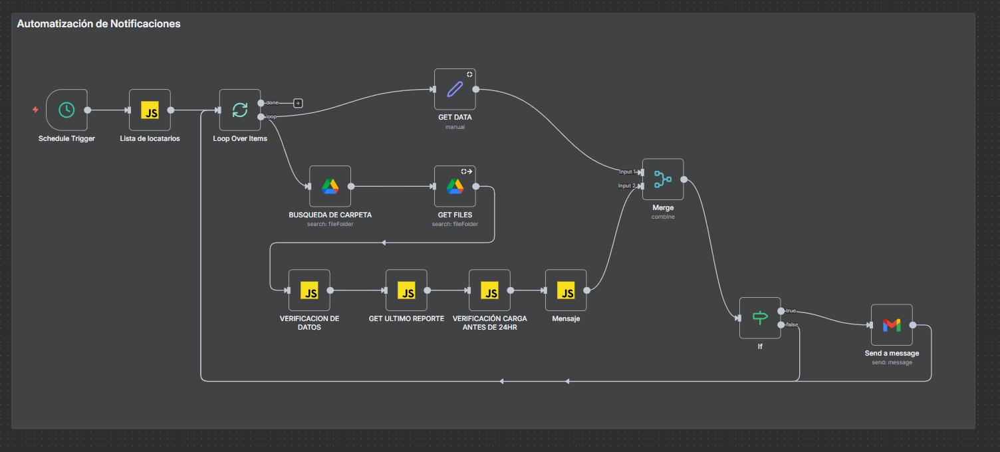
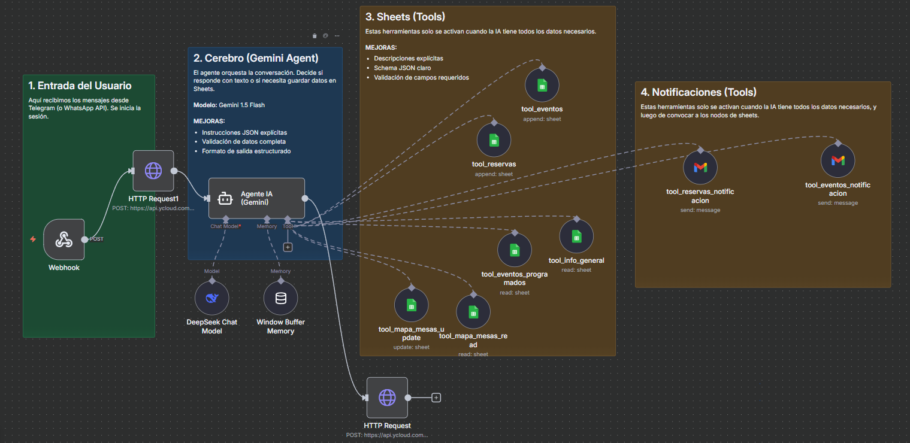
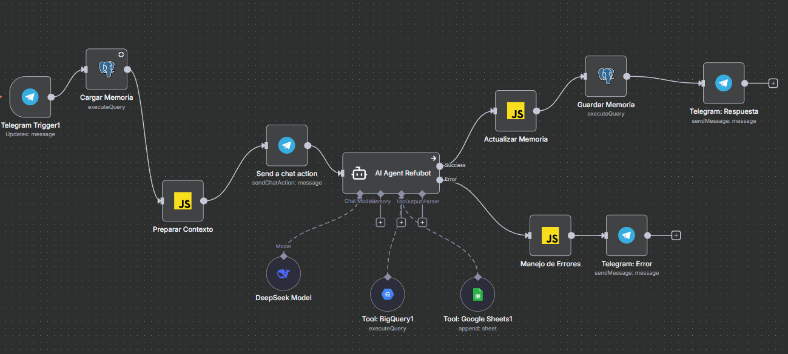

# Ecosistema De Automatizacion Y Analitica - Refugio Gastronómico

Repositorio que consolida flujos de automatizacion y agentes conversacionales para operaciones comerciales, analitica y cumplimiento en Refugio Gastronómico. El enfoque integra BI, IA generativa y orquestacion para convertir datos operativos en decisiones de negocio.

## Stack Tecnico

## Experiencia Profesional

**Asistente de Business Intelligence (BI) y Automatizacion | Grupo Cordillera Blanca | Marzo 2025 - Actualidad**

Asignado a Refugio Gastronómico, hub comercial con aproximadamente 20 locatarios por mes y mas de 60,000 visitantes mensuales.

- Implemente mejoras del flujo ETL con Python para procesamiento semanal de transacciones, limpieza de archivos y mapeo logico via Google Sheets API, consolidando carga final en BigQuery con historico robusto desde 2023.
- Desarrolle un modelo analitico integral en Power BI que correlaciona data transaccional con flujo de personas para seguimiento interanual, evaluacion de rentabilidad espacial (ticket promedio y ventas por m2) y optimizacion de recursos segun tasas de conversion.
- Reduje costos de licenciamiento y centralice gobierno de datos mediante RefuDataWeb, con modulo interno para embebido seguro de dashboards y modulo publico para carga periodica de fuentes por parte de locatarios.
- Diseñe propuesta de arquitectura de datos en GCP para escalabilidad del ecosistema analitico y crecimiento continuo del establecimiento.
- Diseñe e implemente agentes conversacionales RefubotConsultas y RefubotData con LLMs y protocolo MCP para automatizar consultas B2C, registro de reservas/eventos y consultas internas de KPIs en tiempo real.
- Programe automatizaciones de auditoria en la nube para verificacion periodica de cumplimiento en entrega de reportes por parte de locatarios.

## Proyectos Del Repositorio

### 1. AutomatizacionNotificaciones
**Objetivo:** Asegurar cumplimiento en la entrega de reportes de ventas de locatarios.

- Orquesta validaciones diarias en n8n con Schedule Trigger y procesamiento por lotes.
- Consulta Google Drive para detectar ultima carga por locatario y medir horas de desfase.
- Construye mensajes personalizados y envia alertas automaticas via Gmail cuando se exceden 24 horas sin reporte.
- Integra reglas de negocio para escalar notificaciones a responsables operativos y administrativos.

### 2. RefubotConsultas
**Objetivo:** Automatizar atencion comercial para reservas, eventos e informacion general.

- Implementa agente de IA con herramientas para registrar leads en Google Sheets.
- Gestiona flujos conversacionales de WhatsApp con validacion de datos obligatorios.
- Dispara notificaciones automatizadas por correo al equipo comercial en cada reserva o evento registrado.
- Aplica instrucciones de negocio para handoff a atencion humana y respuestas guiadas por contexto.

### 3. RefubotData
**Objetivo:** Habilitar consultas analiticas internas en lenguaje natural para Operaciones.

- Usa agente con memoria conversacional en PostgreSQL para continuidad de contexto.
- Ejecuta consultas en BigQuery para ventas, ticket promedio, flujo de personas y metas.
- Incorpora validacion de nombres de negocios y manejo robusto de errores.
- Entrega respuestas operativas accionables para toma de decisiones en tiempo real.

## Impacto De Negocio

- Mayor continuidad y calidad de datos transaccionales mediante controles de carga y alertamiento preventivo.
- Mejor capacidad de decision comercial y operativa con analitica integrada de ventas y trafico.
- Menor tiempo de respuesta a clientes y equipos internos mediante automatizacion conversacional.
- Base tecnica preparada para escalar el ecosistema de datos y agentes sobre GCP.

## Aplicacion Paso A Paso De La Skill En Este Repo

1. Se definio el objetivo del README: perfil profesional + proyectos + impacto de negocio.
2. Se extrajo el stack tecnico desde experiencia y workflows del repositorio.
3. Se sintetizaron logros en formato accion + tecnologia + resultado.
4. Se estructuro contenido en bloques ejecutivos y escaneables.
5. Se incorporaron badges para visibilidad inmediata del stack.
6. Se describieron los tres proyectos existentes con enfoque problema-solucion-resultado.
7. Se cerro con impactos y pasos de valor para evolucion futura.

## Siguientes Mejoras Recomendadas

- Añadir diagrama de arquitectura end-to-end de datos y agentes.
- Incorporar seccion de KPIs con metricas reales periodicas.
- Publicar ejemplos de prompts y consultas representativas por bot.
